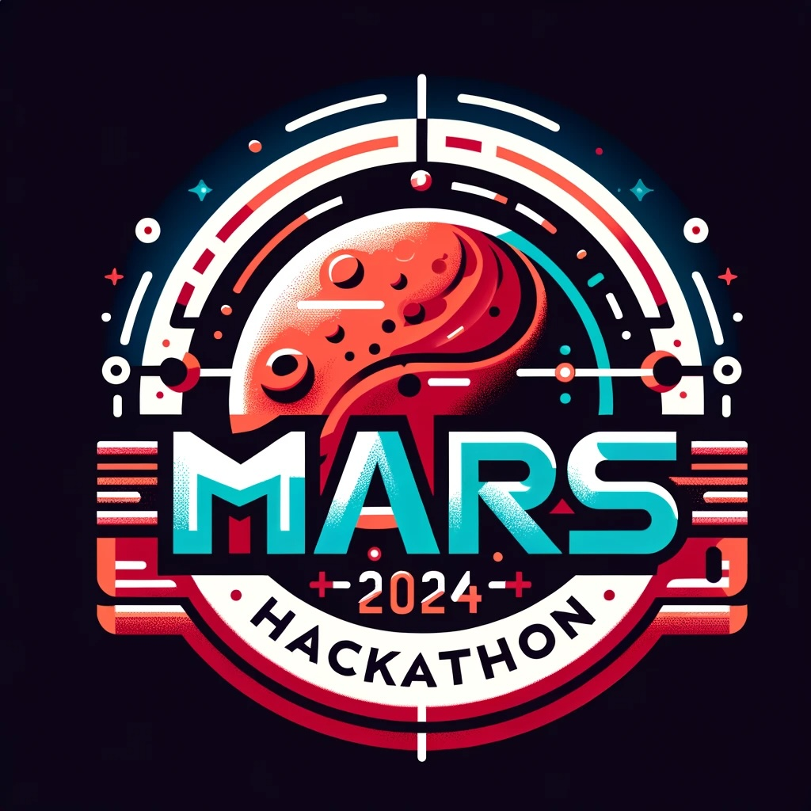

todo: fix readmes and add instructions for building from my gits.

# React + Vite

# Mars Hackathon 2024



**Tags:** `#mars` `#hackathon` `#threejs` `#worlding` `#2024`

---

## Introduction

Hello, World! I'm participating in my first hackathon, the Mars Hackathon 2024. Although I haven't found a team yet, I'm excited to embark on this solo journey and explore the realms of creativity and technology.

---

## Project Brief

**Duration:** 48 hours  
**Topic:** Worlding  
**Initial Concept:** An interactive three.js wiki focused on Mars.college  
**Sub-Concept:** Commercials for non-existent products  

**Description:**  
This project aims to create an interactive educational game that allows content to be swapped between various wikis. The core idea revolves around making learning about Mars more engaging through interactive elements and imaginative commercials for products that don't exist yet.

**Reference:**  
Check out the weather simulator on our Mars Discord: [Mars Discord Link](mars_discord_link)

---

## Development Log

**Date:** 2024-01-19

**Today's Goal:**  
- Set up the basic structure for the interactive world using three.js.  
- Begin brainstorming and designing the commercials for the non-existent products. (this is defintley not at the top of the list & this was obviously generated by GPT!)

**Challenges Faced:**  
- (List any challenges you encounter during the development)

**Achievements:**  
- (List your accomplishments at the end of the day)

---

## How to Contribute

I'm currently working solo on this project, but I'm open to collaboration! If you're interested in worlding, three.js, or have creative ideas for our Mars-themed educational game, feel free to reach out.

**Contact:**  
- Discord: tashi
- Email: delictide@gmail.com

---

## Acknowledgments

A special thanks to Mars Hackathon organizers and the amazing community for this wonderful opportunity.

---

Stay tuned for more updates!

Dev NOtes: day1: 
    - Meeting the concept idea, we'll setup to import SolarSams 3d model of Mars in a three.js env
    - three.js recommends using 3d models in the .glTF or .GLB format
    - ? create navigation game mesh of the objects in blender
    - 

    its occured to me the project or 'game' as it will be deployed should probably be navable as a normal type video game being that i'll be using the 3d model of a real world enviroment. So, should i create a nav mesh of the model in blender? & 2nd, if so, should i use an additional nav mesh libaray in addition to three.js such as one of these: 
    yuka
three-pathfinding
recast-navigation-js
 & which one of these would best encompass my project?

    We choose Yuka for its Ai first design protocols

## step 1: 
    - (create a virtual env)
    conda create -n worlding
    - (open a terminal or ide in your working project ./dir)
    - (activate your env)
    conda activate worlding
    - (install three.js & yuka)

        - yuka
        git clone git@github.com:Mugen87/yuka.git
        (trying to clone direct without an ssh key was not working. Not sure why. SSH worked.)
        - (navigate into the yuka ./dir/yuka)
        npm install

        - three.js
        git clone --depth=1 git@github.com:mrdoob/three.js.git
        - (navigate to ./dir/three.js)
                npm install --save three
        - cd ..
     npm install --save-dev vite
     npx vite

     npm run dev
     npm run build
            
    
    Some key aspects i'd like to see beyond basic navigation and artifact engagment is, obviously, an agent (character) inhabiting the space.

    ## Dev op's Day2:!!!
**dev-ops:**

    my-react-app/
├── node_modules/
├── public/
│   ├── index.html
│   └── ... (other public assets)
├── src/
│   ├── main.jsx (or index.js)
│   ├── App.jsx (or App.js)
│   ├── ... (other source files)
│   └── ... (additional directories as needed)
├── package.json
├── vite.config.js (or other configuration files)
└── ... (other configuration and root-level files)

    
    The initial concept is close to whats about to happen...
    Revisioned the concept with 3 key objectives: 

    1: we have a basic 3d world (and we import a  prefabed .glTF model of the college we built in the desert)
     2: we have nav contorts to move about the space
      3: There is an interactive Ai agent that inhabits the space
       4: (less important & will skip if it adds too much complexity) populate the space with artifacts from our   wiki's, blogs discord and archived information on the college.

# New Project Setup Guide

This guide provides step-by-step instructions on how to set up a new project using Vite and Three.js.

## Prerequisites

Before you begin, ensure you have [Node.js](https://nodejs.org/) installed on your system.

## Creating the Project

### Step 1: Create a New Project Directory

Create a new directory for your project and navigate into it:

```bash
mkdir my-3d-project
cd my-3d-project

Step 2: Initialize a Vite Project
Initialize a new project using Vite. This will create a new project structure:

npm create vite@latest

Follow the prompts to name your project and select a template. For a Three.js project, the 'vanilla' template is a good choice.

Step 3: Navigate to Your Project Directory
After Vite sets up the project, navigate to the newly created project directory:

cd your-project-name

Step 4: Install Three.js
Install Three.js as a dependency in your project:

npm install three

Step 5: Start Developing
You can now start adding your code. Place your JavaScript files in the src directory. To start the development server, run:

npm run dev

Your project is now set up and ready for development!

Additional Notes
The src directory is where you should place your project's source code.
You can customize the project configuration by editing the vite.config.js file.
For detailed documentation on Vite, visit the Vite Documentation.


"GPT-Promptin'"
Prompt:
now we will build for development around three.js like i normally woiuld?
ChatGPT
Yes, now that your project is set up with Vite, you can proceed to build your application around Three.js as you normally would. Vite will handle the development server and build process, allowing you to focus on developing with Three.js. Here's a general guide on how to proceed:

Developing with Three.js in Your Vite Project
Organize Your Project Files:

Place your Three.js code in the src directory. This is where you'll write your JavaScript code for the 3D environment.
If you have assets like textures, models, or additional scripts, you can organize them in the public or another appropriate directory within your project.
Create Your Main Three.js Scene:

Start by creating a main file for your Three.js code, like main.js or scene.js, in the src directory.
In this file, initialize your Three.js scene, camera, renderer, and any objects or lighting you need.
Integrate Three.js Scene into Your HTML:

Your Vite project will have an index.html file in its root. Include your Three.js script here.
You can link to your JavaScript file within a <script> tag if you're using the Vanilla template.
Develop and Test:

As you develop your Three.js application, you can use Vite's development server to test and see your changes in real-time.
Run npm run dev to start the server, and visit the provided local URL in your browser to view your application.
Handle Imports and Dependencies:

If you're using additional libraries or modules, make sure to import them properly at the top of your JavaScript files.
Iterate and Expand:

Continue building out your 3D environment, adding interactivity, and refining your application.
Utilize Three.js's documentation and community resources for guidance and troubleshooting.
Example Basic Three.js Setup
Here's an example of how a basic Three.js setup might look in a file like src/main.js:

javascript
Copy code
import * as THREE from 'three';

const scene = new THREE.Scene();
const camera = new THREE.PerspectiveCamera(75, window.innerWidth / window.innerHeight, 0.1, 1000);
const renderer = new THREE.WebGLRenderer();
renderer.setSize(window.innerWidth, window.innerHeight);
document.body.appendChild(renderer.domElement);

const geometry = new THREE.BoxGeometry();
const material = new THREE.MeshBasicMaterial({ color: 0x00ff00 });
const cube = new THREE.Mesh(geometry, material);
scene.add(cube);

camera.position.z = 5;

function animate() {
    requestAnimationFrame(animate);
    cube.rotation.x += 0.01;
    cube.rotation.y += 0.01;
    renderer.render(scene, camera);
}

animate();
Next Steps
Regularly test your application in the browser to ensure everything is working as expected.
If you encounter issues, consult the Three.js documentation and community forums for support.
Remember to commit your changes to version control regularly.
Now that your environment is set up with Vite, you can leverage its fast build times and hot module replacement to efficiently develop your Three.js application.


Notes: night2


ref::: 

- [@vitejs/plugin-react](https://github.com/vitejs/vite-plugin-react/blob/main/packages/plugin-react/README.md) uses [Babel](https://babeljs.io/) for Fast Refresh
- [@vitejs/plugin-react-swc](https://github.com/vitejs/vite-plugin-react-swc) uses [SWC](https://swc.rs/) for Fast Refresh
